# PayFlow — System Flowcharts

---

## 1. Payment Lifecycle — State Machine

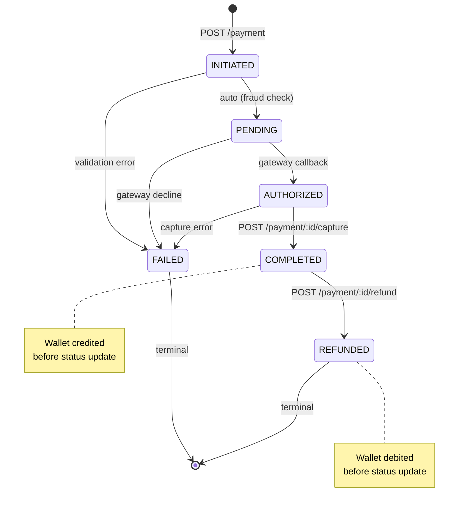

---

## 2. Initiate Payment — Idempotency Flow

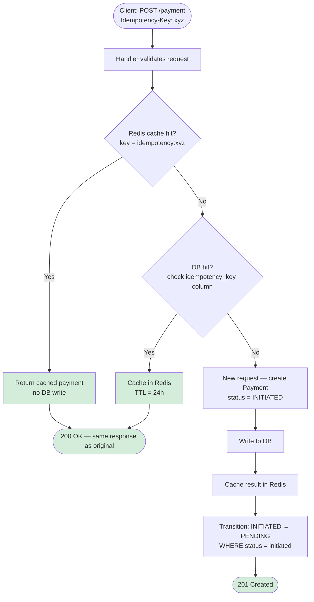

---

## 3. Capture Payment — Money Before Status

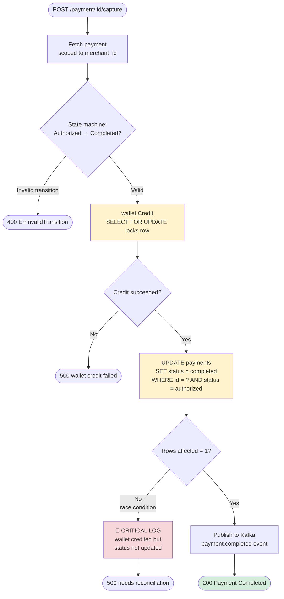

---

## 4. Refund Payment

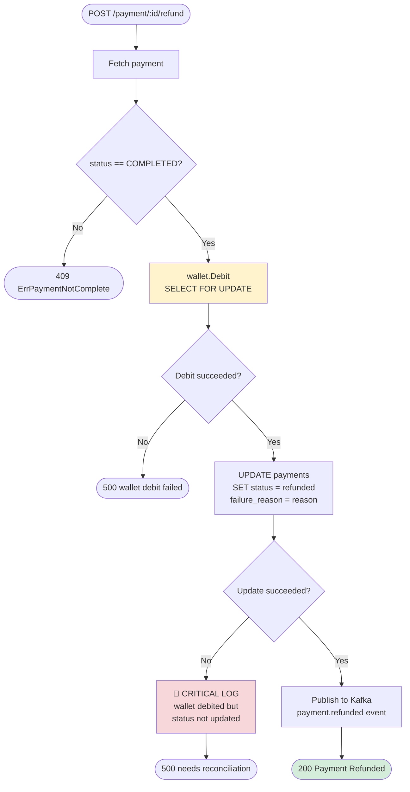

---

## 5. Wallet Credit / Debit — Atomic DB Transaction

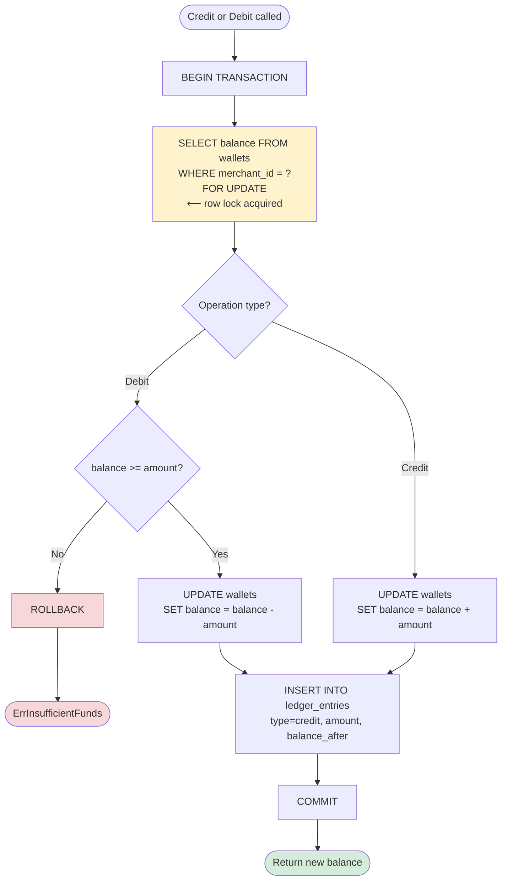

---

## 6. Auth — Register & Login

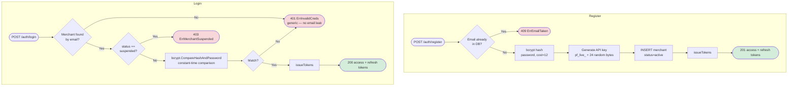

---

## 7. Auth — Token Refresh & Google OAuth

```mermaid
flowchart TD
    subgraph Refresh
        RF1([POST /auth/refresh\nrefresh_token cookie]) --> RF2[Hash raw token]
        RF2 --> RF3{Found in DB\nby token_hash?}
        RF3 -- No --> RF4([401 ErrTokenExpired])
        RF3 -- Yes --> RF5{expires_at < now?}
        RF5 -- Yes --> RF6[DELETE from DB]
        RF6 --> RF4
        RF5 -- No --> RF7[Fetch merchant]
        RF7 --> RF8[DELETE old refresh token\none-use rotation]
        RF8 --> RF9[issueTokens — new pair]
        RF9 --> RF10([200 new tokens])
    end

    subgraph Google OAuth
        G1([GET /auth/google/callback]) --> G2{Find by\ngoogle_id?}
        G2 -- Found --> G3{Suspended?}
        G3 -- Yes --> G4([403])
        G3 -- No --> G5[issueTokens]
        G2 -- Not found --> G6{Find by\nemail?}
        G6 -- Found --> G7[Link google_id\nto existing account]
        G7 --> G3
        G6 -- Not found --> G8[Auto-register merchant\nno password set]
        G8 --> G3
        G5 --> G9([200 tokens])
    end

    style RF4 fill:#f8d7da
    style G4 fill:#f8d7da
    style G9 fill:#d4edda
    style RF10 fill:#d4edda
```

---

## 8. Kafka Event Pipeline — End to End

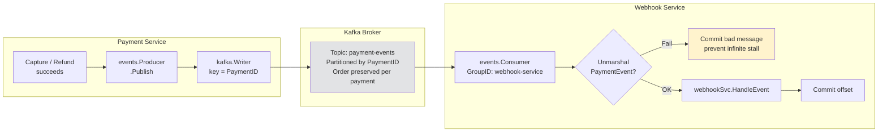

---

## 9. Webhook Delivery — Fan-out & Retry

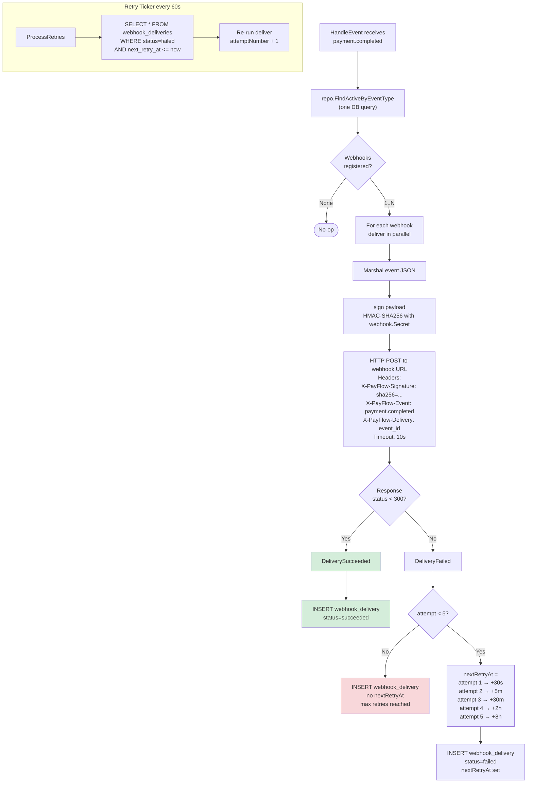

---

## 10. HMAC Signature Verification (Merchant Side)

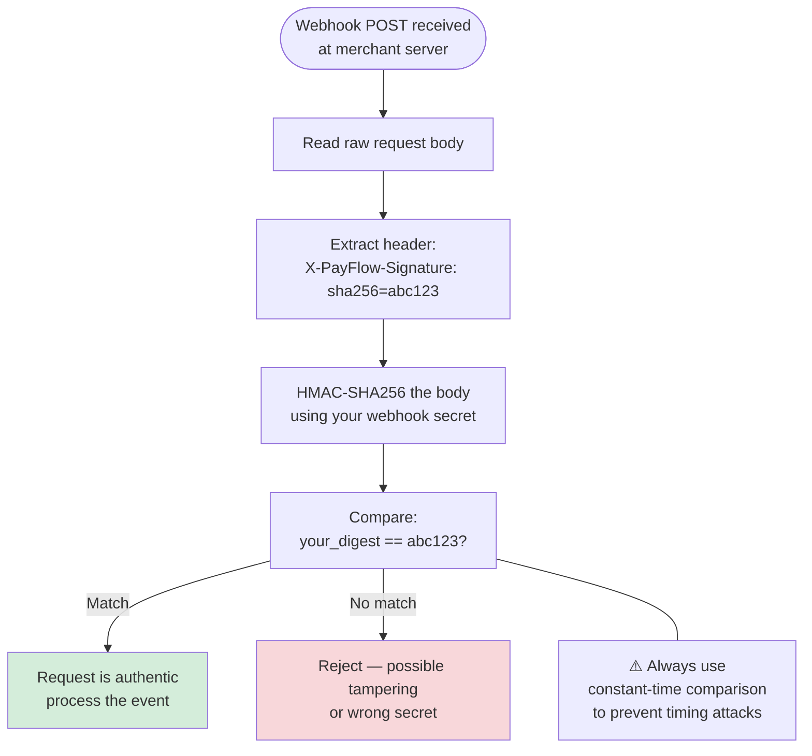

---

## 11. Full Request Journey — Payment Completed

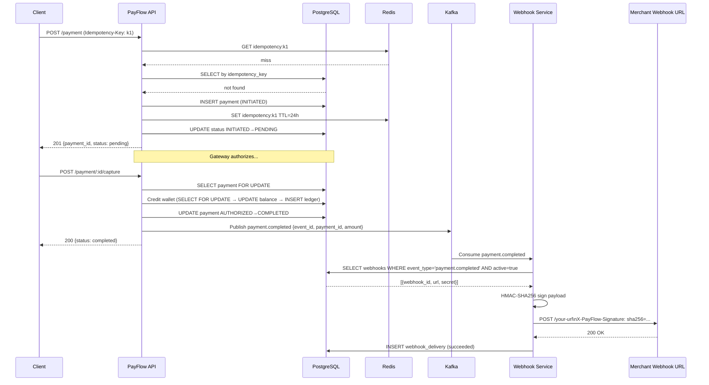

---

## Key Design Decisions — Quick Reference

| Concept | Where | Why |
|---|---|---|
| Idempotency Redis → DB two-layer | `payment/service.go Initiate` | Redis is fast but expires; DB is the source of truth |
| `WHERE status = ?` in UPDATE | `payment/repository.go UpdateStatus` | Optimistic lock — prevents race conditions without explicit locks |
| Wallet credit **before** status update | `payment/service.go Capture` | Money must move first; status is just a label |
| `SELECT FOR UPDATE` on wallet | `wallet/repository.go` | Prevents two simultaneous captures both reading same balance |
| HMAC-SHA256 on webhooks | `webhook/service.go sign` | Merchant can verify payload hasn't been tampered with |
| Exponential backoff, max 5 attempts | `webhook/service.go retryDelays` | Respects merchant server capacity; stops infinite retries |
| Kafka key = PaymentID | `events/producer.go` | All events for same payment go to same partition → ordered |
| Commit only after handler success | `events/consumer.go` | At-least-once delivery guarantee |
