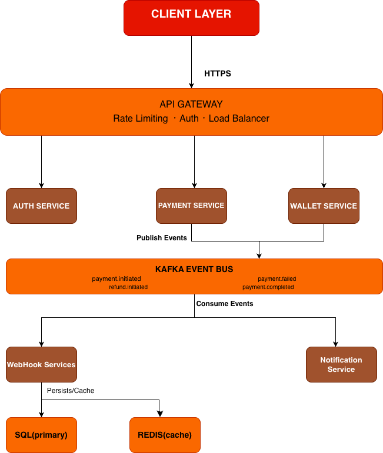

# PayFlow System Design

## 1. Overview

PayFlow is a payment processing platform built with a microservices architecture. It handles merchant authentication, payment creation, wallet management, and reliable webhook delivery.

---

## 2. High Level Architecture

The system follows a microservices architecture.

**Components:**

- **Client Layer** — Merchant applications and dashboards
- **API Gateway** — Request routing, rate limiting, authentication
- **Core Services** — Auth, Payment, Wallet
- **Event Bus** — Asynchronous communication (Kafka)
- **Consumer Services** — Webhook, Notification, Fraud Detection
- **Data Layer** — PostgreSQL, Redis

---

## 3. Core Services

### Auth Service

**Responsibilities:**

- Merchant authentication
- JWT token generation
- API key validation

**Technologies:**

- Go
- JWT
- bcrypt

### Payment Service

**Responsibilities:**

- Payment creation
- Idempotency handling
- Payment state transitions
- Publishing events to Kafka

### Wallet Service

**Responsibilities:**

- Wallet balance management
- Double-entry ledger
- Prevent double spending

**Uses:**

- `SELECT FOR UPDATE` locking

---

## 4. Event Driven Architecture

### Event Bus

Apache Kafka is used for asynchronous communication between services.

**Events include:**

- `payment.initiated`
- `payment.completed`
- `payment.failed`
- `refund.initiated`

**Consumers:**

- Webhook Service
- Notification Service
- Fraud Detection

---

## 5. Database Design

The system uses PostgreSQL as the primary transactional database.

**Key tables:**

- `merchants`
- `payments`
- `wallets`
- `ledger_entries`
- `webhooks`
- `webhook_deliveries`

---

## 6. Payment Flow

1. Client initiates payment request
2. API Gateway authenticates request
3. Payment Service checks idempotency
4. Payment record is created
5. Wallet Service debits merchant wallet
6. Payment Service publishes event to Kafka
7. Webhook Service sends event to merchant

---

## 7. Idempotency

Clients send an **Idempotency-Key** header.

Redis stores the key for **24 hours**.

If the same request is received again:

- The cached response is returned
- No new payment is created

Duplicate payments must be prevented to ensure financial correctness and avoid double charges.

---

## 8. Double Entry Ledger

Every wallet transaction creates two entries:

- **Credit entry**
- **Debit entry**

**Benefits:**

- Immutable audit trail
- Financial consistency
- Easy reconciliation

---

## 9. Webhook Reliability

Webhook events are retried with **exponential backoff**.

**Retry Strategy:**

| Attempt | Delay      |
|---------|------------|
| 1       | immediately|
| 2       | 30 seconds |
| 3       | 5 minutes  |
| 4       | 30 minutes |
| 5       | 1 hour     |

Failed deliveries are moved to a **Dead Letter Queue**.

---

## 10. Scalability

The system is designed for horizontal scaling.

**Strategies:**

- Stateless microservices behind load balancers
- Kafka partitioned by `merchant_id`
- Database read replicas for dashboard queries
- Payments table partitioned by time

---

## 11. Tradeoffs

### Consistency vs Availability

Payment systems prioritize **consistency** over availability.

During network partitions:

- The system returns errors rather than risking incorrect balances.

---

## 12. Future Improvements

- Add fraud detection engine
- Implement payment processor adapters
- Add distributed tracing
- Implement rate limiting per merchant
